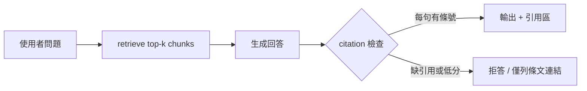

# #002 公開法規 Agentic RAG

> 定稿日：2026-06-25｜狀態：**候選池** → corpus **已鎖定**（洗錢防制法體系）

## 一句話

以台灣**洗錢防制法體系**公開法規（母法 + 金管會／銀行局子法）建 mini corpus，做 **Agentic RAG**：每則回答附**條號引用**、不確定則拒答，並掛 10 題 **golden set eval**（可併 [#001](/projects/ideas/2026-06-03-001-agentic-rag-eval-kit.md)）。

## Corpus 選型（2026-06-25 定案）

### 三選項比較

| 選項 | citation 穩定 | eval 可重現 | 金融／銀行敘事 | 7 天 scope | 決策 |
|------|---------------|-------------|----------------|------------|------|
| **洗錢防制法體系** | 高（第 X 條） | 高 | **高**（KYC／AML／CDD） | 3～4 部法規 | **MVP 首選** |
| **銀行法全文** | 高 | 高 | 中（過寬、非合規專題） | 200+ 條易膨脹 | **Phase 2** 子集 |
| **裁罰新聞稿** | 中（敘事體） | **低**（週更） | 中（執法態度） | HTML 結構不一 | **Phase 2** 補充 |

（推測）評分依 #002 MVP 需求（citation、eval、國泰敘事）綜合判斷；[2026-06-25-002-corpus-規劃](/sources/2026-06-25-002-corpus-規劃.md)

**為何不是銀行法先？** 銀行法涵蓋設立、業務、監督等，Q&A 易發散；洗錢防制體系**條文短、義務明確、與 AI 架構師場景重疊高**。（推測）

**為何不是裁罰新聞稿先？** 適合展示「近期執法」但 **golden set 難維護**（新稿不斷、事實題答案變動）；宜作第二層 corpus，與法條題分開 eval。（推測）

### MVP 文件清單（鎖定 4 部，≤ 約 15 萬字）

| ID | 法規名稱 | 主管／來源 | 公開 URL（起點） | 角色 |
|----|----------|------------|------------------|------|
| `aml-act` | [洗錢防制法](https://law.moj.gov.tw/LawClass/LawAll.aspx?pcode=G0380136) | 全國法規資料庫 | `pcode=G0380136` | 母法：義務主體、申報、罰則框架 |
| `aml-finst` | [金融機構防制洗錢辦法](https://law.moj.gov.tw/LawClass/LawAll.aspx?pcode=G0380252) | 金管會（銀行目） | `pcode=G0380252` | 金融機構 CDD、監控、申報細節 |
| `aml-bank-ic` | 銀行業及其他經金管會指定之金融機構防制洗錢及打擊資恐**內部控制與稽核制度實施辦法** | [金管會法令](https://law.fsc.gov.tw/)／[銀行局](https://law.banking.gov.tw/) | 於 FSC 法令系統搜尋全名 | 銀行專規：內控、專責人員、稽核 |
| `aml-act-enf` | 洗錢防制法施行細則（**可選**） | 全國法規資料庫 | 搜尋「洗錢防制法施行細則」 | 縮 scope 時刪；保留則補充定義 |

**不納入 MVP：** 銀行法全文、裁罰新聞稿、內規／範本 PDF（非法律位階，且來源分散）。

### Phase 2 擴充（MVP 後）

| 層 | 內容 | 用途 |
|----|------|------|
| **執法層** | 金管會「裁罰」新聞稿（近 12 個月，≤10 則） | 「類似案例怎麼罰」；eval 標 `type=enforcement` |
| **一般銀行法** | 銀行法第 X 章（內部控制／公司治理相關條文子集） | 拓廣非 AML 合規題 |
| **跨法** | 個人資料保護法節錄（金融客戶資料） | 與 CDD 資料保存連結 |

## 資料管線（Day 1 詳規）

### 原則

- **僅**政府公開站；手動下載 HTML／「匯出」可接受，MVP 不追求全自動爬蟲。
- 每份文件寫入 `corpus/manifest.json`；正文 `corpus/raw/{doc_id}.html` 或 `.txt`。
- 記錄 **法規修正日期**（頁面「修正日期」），供 eval 回歸註記。

### `manifest.json` 欄位（建議）

```json
{
  "doc_id": "aml-finst",
  "title": "金融機構防制洗錢辦法",
  "source_url": "https://law.moj.gov.tw/LawClass/LawAll.aspx?pcode=G0380252",
  "issuer": "金融監督管理委員會",
  "revision_date": "110-12-14",
  "fetched_at": "2026-06-25",
  "format": "html",
  "chunk_strategy": "by_article"
}
```

### Day 1 時程（約 2～3h）

| 步驟 | 動作 | 完成標準 |
|------|------|----------|
| 1 | 自 MOJ 開啟 `aml-act`、`aml-finst`，另存 HTML 或複製「所有條文」至 `corpus/raw/` | 2 檔 + manifest 2 列 |
| 2 | 自 [law.fsc.gov.tw](https://law.fsc.gov.tw/) 或 [law.banking.gov.tw](https://law.banking.gov.tw/) 取得 `aml-bank-ic` 條文 | 1 檔 |
| 3 | 寫 `scripts/fetch_moj_law.py`（可選）：給 `pcode` 拉單一法規 HTML | 能重現 Day 1 |
| 4 | 人工 spot-check 3 條：條號是否在原文可搜尋 | 避免 PDF 亂碼 |
| 5 | README `corpus/README.md`：來源聲明 + 免責（**非法律意見**） | 公開 repo 必備 |

### Chunk 策略（Day 2）

| 欄位 | 說明 |
|------|------|
| `doc_id` | manifest 鍵 |
| `article` | 第 N 條（解析失敗則 `paragraph_id`） |
| `text` | 條文正文 |
| `revision_date` | 來自 manifest |

- **粒度**：一條一 chunk；過長條文（項次多）可按「項」再切，metadata 仍掛同一條。
- **不**跨條合併（利於 citation hit rate eval）。

## Agent 行為（Day 2～3）



- **System prompt 硬規則**：僅能依 corpus；每個事實句尾標 `(洗錢防制法第 X 條)` 或對應子法。
- **拒答觸發**：檢索分數低、問題涉個案裁罰預測、問「會不會被罰」→ 改列相關條文 + 免責。
- **免責 footer**：本系統不構成法律意見；以主管機關最新公布為準。

## Golden Set（Day 4，10 題草稿）

評分：`citation_hit`（預期條號是否出現）、`refusal_correct`（該拒是否拒）。

| # | 問題（使用者） | 預期引用（至少） | 備註 |
|---|----------------|------------------|------|
| 1 | 金融機構定義包含哪些類型？ | 洗錢防制法第 3 條 / 金融機構防制洗錢辦法第 2 條 | 定義題 |
| 2 | 什麼是風險基礎方法？ | 金融機構防制洗錢辦法第 2 條（定義） | 名詞解釋 |
| 3 | 客戶身分確認（CDD）要做哪些事？ | 金融機構防制洗錢辦法第 7 條起 | 程序題 |
| 4 | 持續審查客戶身分在什麼時機要做？ | 金融機構防制洗錢辦法第 8 條 | 銀行局頁面常引 |
| 5 | 交易紀錄要保存多久？ | 金融機構防制洗錢辦法第 12 條 | 數字題 |
| 6 | 疑似洗錢交易如何申報？ | 金融機構防制洗錢辦法第 15 條 | 程序題 |
| 7 | 銀行防制洗錢內部控制誰負責？ | `aml-bank-ic` 董事會／專責人員相關條 | 內控題 |
| 8 | PEP（重要政治性職務人士）查詢要求？ | 金融機構防制洗錢辦法第 10 條 | 實務熱點 |
| 9 | 虛擬資產業者是否適用洗錢防制法？ | 洗錢防制法第 3 條（近年修正項） | 可測拒答邊界 |
| 10 | 某某銀行上月被罰多少？ | **拒答** | 測試不臆測裁罰；Phase 2 才可答 |

（推測）條號以 ingest 當下法規為準；改版後 golden 需更新 `revision_date` 並跑回歸。

## 7 天 MVP（更新）

| 日 | 交付 |
|----|------|
| **Day 1** | 上表 3～4 法規入庫 + `manifest.json` + 免責 README |
| **Day 2** | 條文 chunk + 向量庫；metadata 含 `doc_id`／`article` |
| **Day 3** | LangGraph（或 bloss0m RAG）+ citation 節點 + 拒答 |
| **Day 4** | 10 題 golden YAML；第 10 題為 refusal |
| **Day 5** | `/eval/run` → citation_hit、refusal_accuracy、latency |
| **Day 6–7** | README 架構圖 + [bloss0m-com](/entities/bloss0m-com.md) 短文 |

**縮 scope**：刪 `aml-act-enf`；golden 改 5 題（含 1 拒答）仍達標。

## 轉職訊號

面試可說：選 **AML 法規 corpus** 是因條文可稽核、與銀行合規場景一致；刻意**不做**裁罰新聞稿 MVP，因 eval 需穩定；Phase 2 再加執法層展示完整合規助手分層。（推測）

## 風險與緩解

| 風險 | 緩解 |
|------|------|
| 法規修正 | manifest `revision_date`；eval 失敗時先 diff 條文 |
| 條號解析錯誤 | Day 1 spot-check；chunk 保留原文前 20 字 |
| 過度法律建議 | 免責 + 拒答個案預測 |
| MOJ HTML 變更 | `fetch_moj_law.py` 單一 pcode 可測 |

## 評分（2026-06-25）

| 維度 | 分數 |
|------|------|
| 求職相關 | 5 |
| Agent 深度 | 4 |
| 7 天可交付 | 4 |
| 時事相關 | 4 |
| 金融場景 | 4 |
| **總計** | **21 / 25** |

## Agent 維度

編排 · 工具（檢索）· **eval** · **安全（拒答／引用）**

## Relationships

- related_to: [金融業-ai-agent-side-發想](/concepts/金融業-ai-agent-side-發想.md)
- related_to: [2026-06-03-001-agentic-rag-eval-kit](/projects/ideas/2026-06-03-001-agentic-rag-eval-kit.md)
- related_to: [金融業-agent-應用探索](/queries/金融業-agent-應用探索.md)
- grounded_in: [2026-06-25-金融業-agent-應用探索](/sources/2026-06-25-金融業-agent-應用探索.md)
- grounded_in: [2026-06-25-002-corpus-規劃](/sources/2026-06-25-002-corpus-規劃.md)

# Citations

[1] [2026-06-25-金融業-agent-應用探索](/sources/2026-06-25-金融業-agent-應用探索.md) — `raw/sources/2026-06-25-金融業-agent-應用探索.md`
[2] [2026-06-25-002-corpus-規劃](/sources/2026-06-25-002-corpus-規劃.md) — `raw/sources/2026-06-25-002-corpus-規劃.md`
[3] [洗錢防制法](https://law.moj.gov.tw/LawClass/LawAll.aspx?pcode=G0380136) — 全國法規資料庫（外部）
[4] [金融機構防制洗錢辦法](https://law.moj.gov.tw/LawClass/LawAll.aspx?pcode=G0380252) — 全國法規資料庫（外部）
